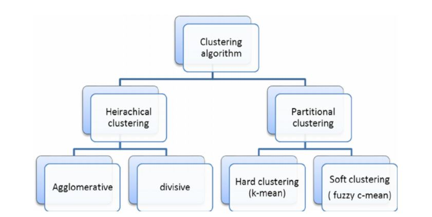
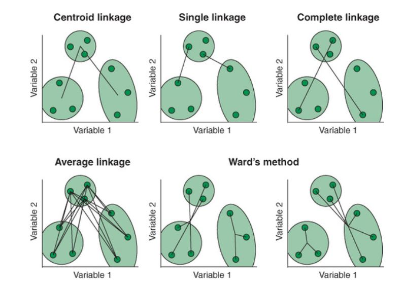
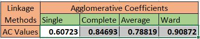
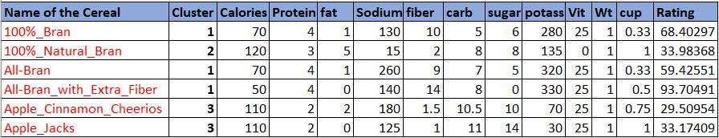
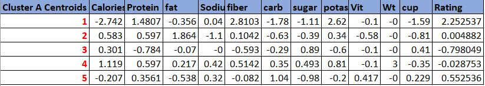
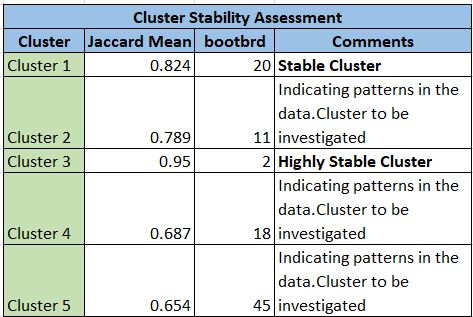

```{r setup, include=FALSE}
knitr::opts_chunk$set(echo = TRUE)

```

## Hierarchical Clustering:

The purpose of this assignment is to use Hierarchical Clustering.

The dataset Cereals.csv includes nutritional information, store display, and consumer ratings for 77 breakfast cereals. This dataset consists of 77 observations and 16 features The variables in the dataset are:

-   **Name** : Name of the Cereal

-   **Mfr** : Manufacturer of the Cereal, which has different classifications

               1. A = American HomeFood Products

               2. G = General Mills

               3. K = Kelloggs

               4. N = Nabisco

               5. P = Post

               6. Q = Quaker Oats

               7. R = Ralston Purina

-   **Type** : This is categorized as two types 1. Hot 2. Cold

-   **calories**: Number of calories per serving

-   **Protein** : grams of protein

-   **Fat** : grams of fat

-   **Sodium** : milligrams of sodium

-   **Fiber** : grams of dietary fiber

-   **Carbo** : grams of carbohydrates

-   **Sugars** : grams of sugars

-   **Potass** : milligrams of potassium

-   **Vitamins:** Vitamins and minerals and it is classified by the typical percentage of FDA recommended (0,25,100)

-   **Shelf** : display shelf ( 1, 2 or 3, counting from floor)

-   **Weight** : weight in ounces of one serving

-   **Cups** : number of cups in one serving

-   **Rating** : rating of the cereals( from consumer reports)

### Loading the required libraries

```{r message=FALSE,warning=FALSE}
library(factoextra)
library(cowplot)
library(caret)
library(knitr)
library(dummies)
library(psych)
library(cluster)
library(dplyr)
library(tibble)
library(tidyverse)
library(tidyr)
library(fpc)

options(knitr.duplicate.label = "allow")
```

## Data Exploration

```{r echo=FALSE}
#Importing the Dataset
cereal_data <- read.csv("Cereals.csv")
#To check for the dimensions of the dataset
dim(cereal_data)

```

The cereal data has 77 observations and 16 features.

## Data Preparation

```{r}
# Checking for NA Values
colMeans(is.na(cereal_data))
```

We can see that carbo, sugars and potass variables have missing values in the dataset. So we have removed the NA values.

```{r}
cereal_data<- cereal_data[complete.cases(cereal_data),]
# Transform the cereal name into a row name for better visualization of the data
cereal<-data.frame(cereal_data,row.names = 'name')
# Remove the 1st, 2nd and 12 columns as they are qualitative variables
cereal_Numerical <- cereal[,-c(1,2,12)]
```

## Data Normalization

Since we are dealing with variables of very different nature that are expressed in different units, we have to normalized the data before applying any algorithm.

```{r}

#Normalize the data using scale function
cereal_Norm <- scale(cereal_Numerical)

#Top rows of the dataset after preprocessing
head(cereal_Norm)

# To check for the dimensions of the dataset after data preprocessing
dim(cereal_Norm)
```

There are 74 observations and 12 features.

## Distance Measure

For computing distance, we are going to use the **get_distance** function.It uses the Euclidean distance as default metric and **fviz_clust** is to visualize the distance matrix.

```{r}
#Computing distance. Euclidean distance as a default metric
distance<- get_dist(cereal_Norm)
# Plotting the distance. 
fviz_dist(distance,show_labels = FALSE)
```

### Distance Matrix Plot

The above plot shows the different intensity of color for different distances. As we can see , the diagonal has a value equal to zero because it indicates the distance of an observation from itself.The purple indicates that farthest distance between the point and red indicates the nearest distance.

\newpage

## Questions:

### A. Apply hierarchical clustering to the data using Euclidean distance to the normalized measurements. Use Agnes to compare the clustering from single linkage, complete linkage, average linkage, and Ward. Choose the best method.

## [Hierarchical Clustering]{.ul}:

This clustering is one of the unsupervised machine learning algorithm to group data points based on the similarities.In other words, it is a hierarchical decomposition of the data based on the group similarities.



As we can see in the above image that, clustering is divided into two categories. Hierarchical clustering uses two techniques to group the data.

-   **Agglomerative Nesting (AGNES)** - Bottom to Up approach

-   **Divisive Analysis (DIANA)** - Top to Bottom approach

Now lets perform Hierarchical clustering using hclust function

```{r}
set.seed(123)
## Now we run Hierarchical Clustering using complete linkage
hc1<- hclust(distance,method = "complete")
```

```{r}
set.seed(123)
#plot the obtained dendrogram
plot(hc1,cex=0.6,hang=-1,
     main= "Dendrogram for Hierarchial Clustering")

```

From the above plot we can see that hierarchy resembles as tree structure which is called as dendrogram. This dendrogram helps us to define the number of clusters needed to classify the dataset.

\newpage

## AGNES Method

This AGNES method is a bottom-up approach and we are going to use this method to compare different linkages.



```{r}

set.seed(123)

# Compute with Agnes method and different linkage methods

hc_single<-agnes(distance,method = "single")
hc_complete<-agnes(distance,method = "complete")
hc_average<-agnes(distance,method = "average")
hc_ward <- agnes(distance,method = "ward")

# Compare  Agglomerative Coefficients
print(hc_single$ac)
print(hc_complete$ac)
print(hc_average$ac)
print(hc_ward$ac)

```



**OBSERVATIONS:**

Here, we can see that **Ward's method** is the best method and identifies the strongest clustering structure of the four methods assessed.

Ward method - find the pair of clusters that leads to minimum increase in total within-cluster variance after merging(which is 90.4% accurate)

## B. How many clusters would you choose?

### To find the optimal value of K:

In a dendrogram, the height of each of the branch represents the distance between the two data points being connected. Here, the height describes about variations in the nutrients content in cereals. Taller the branch more cereals with dissimilarities are included in cluster which will increase the nutrition value of the cluster.

Generally in many cases, The number of clusters(K) can be determined by height of the tree in dendrogram. To be more accurate, I wanted to follow the two standard approaches.

-   Elbow Method

-   Average Silhouette Method

```{r}
# Elbow Method
elbow<-fviz_nbclust(cereal_Norm, FUN = hcut,method = "wss") +
  geom_vline(xintercept = 5,linetype=5)+
  labs(subtitle = "Elbow Method")

# silhouette Method
sil<-fviz_nbclust(cereal_Norm, FUN = hcut,method = "silhouette") +
  labs(subtitle = "Average Silhouette Method")
plot_grid(elbow,sil)
```

From above plots, we can see that k=5 from elbow method and k= 10 from Average silhouette method.

However we can see that with 5 clusters we could get a satisfying result and also looks good for interpretation.

### Clustering data with K=5

```{r}
# Cut the tree with k=5
cluster5<-cutree(hc_ward,k=5)
# Number of items in each cluster
table(cluster5)
# Interpret the cluster data with their corresponding cluster number
total_cluster <- cbind(cluster5, cereal_Numerical)
colnames(total_cluster)[1] <- "clusters5"
```

\newpage

The below table represents the top rows of the data with their corresponding cluster number.



### AGNES dendrogram for k=5

```{r warning=FALSE}
# AGNES Dendrogram for k=5
fviz_dend(hc_ward,k=5,
          color_labels_by_k = TRUE,
          k_colors = c("Black","Blue","DarkGreen","Red","Purple"),
          cex=0.5,labels_track_height = 16,
          main = "AGNES DENDROGRAM",
          ggtheme=theme_bw())
```

This is the dendrogram of AGNES using Ward linkage method where k=5.

\newpage

## C. Comment on the structure of the clusters and on their stability.

To check stability, partition the data and see how well clusters formed based on one part apply to the other part. To do this:

-   Cluster partition A.

-   Use the cluster centroids from A to assign each record in partition B (each record is assigned to the cluster with the closest centroid).

-   Assess how consistent the cluster assignments are compared to the assignments based on all the data.

### Interpretation of clusters with respect to the variables.

```{r echo=FALSE}
# To Calculate the centroids of all the Numerical variables in the dataset
centroids_all_data <- aggregate(cereal_Norm, by=list(cluster=cluster5), mean)
Average_of_Variables<- data.frame(centroids_all_data) %>% rowid_to_column()

colnames(Average_of_Variables) <- c("RowID","Cluster","Cal","Pro","fat","Sod","Fiber",
                                    "Carb","Sug","K","Vit","Wt",
                                    "Cup","Rat")
df<-Average_of_Variables %>% 
  pivot_longer(Cal:Rat,names_to = "Variables",values_to = "Average") %>%
  arrange(Variables) 

df$rowid<-as.factor(df$RowID)


#esquisser(df)

library(ggplot2)

ggplot(df) +
 aes(x = Variables, fill = rowid, group = rowid, weight = Average) +
 geom_bar(width=0.7,position = "dodge") +
 scale_fill_hue(direction = 1) +
 labs(fill = "Cluster") +
 theme_minimal() 
```

### Data Split:

To check the stability, we can divide the original dataset in 2 parts, partition A and partition B. Then, we see how similar the sets of clusters have been created for the 2 partitions and the original dataset.

More precisely, we are going to allocate 50% of the data to partition A and the rest 50% to partition B.

```{r}
set.seed(123)
#Partiton A with 50% of data i.e, 37 observations
PartitionA <- cereal_Numerical[1:37,] 
#Partiton B with 50% of data i.e, remaining 37 observations
PartitionB <- cereal_Numerical[38:74,] 

# Normalisation of two partitions
Partition_A_Norm<-scale(PartitionA)
Partition_B_Norm<-scale(PartitionB)
```

### Clustering Partition A

```{r warning=FALSE}
set.seed(123)
#Compute the distances, Euclidean Metric is used as default
distance_A <- get_dist(Partition_A_Norm)
#Apply Hierarchical clustering to Partition A using ward method
hc_w_A <- agnes(distance_A, method = "ward")
#Cut tree into 5 groups
cluster_A<-cutree(hc_w_A,k=5)

# Store the clusters in a data frame along with the cereals data
cereal_A <- cbind(cluster_A, Partition_A_Norm)
# Have a look at the head of the new data frame
colnames(cereal_A)[1] <- "cluster_A"

#Number of items in each cluster
table(cluster_A)

```

```{r echo=FALSE,warning=FALSE}
#Plot the Dendrogram
fviz_dend(hc_w_A,k=5,
          color_labels_by_k = TRUE,
          k_colors = c("Black","Blue","DarkGreen","Red","Purple"),
          cex=0.5,labels_track_height = 16,
          main = "AGNES Dendrogram for Partition A",
          ggtheme=theme_bw())

```

After clustering the partition A, we have to use the cluster centroids from A to assign each record in partition B (each record is assigned to the cluster with the closest centroid).

### Calculate Centroids of Cluster A :

```{r}
centroid_A<- aggregate(Partition_A_Norm, by=list(cluster=cluster_A), mean)
```

**The below table indicates the Centroids of Partition A Clusters**



Now after we calculated the centroids of the clusters found by hierarchical clustering we will assign each observation of dataset B to the closest centroids of A clusters.

\newpage

### Assign observations of Partition B to the cluster centroids of Partition A.

```{r}

# Now we can assign observations of B partition based on the clusters centroids of partition A.
Assign<- data.frame(Cer=seq(1,37,1),cluster=rep(0,37))

for(i in 1:37)
{
  q<-as.data.frame(rbind(centroid_A[,-1],Partition_B_Norm[i,]))
  m<-as.matrix(get_dist(q))
  Assign[i,2]<-which.min(m[6,-6])
}

rownames(Assign) <-rownames(Partition_B_Norm)
```

We need to know which clusters the observations of partition B are assigned to.

```{r}
# Display the top rows of the Partition B
head(table(Assign))
table(Assign$cluster==total_cluster[38:74,1])
```

When we check for the accuracy of parition B, it is almost 55% and also we can see that all the records in the partition B is assigned to 2,3,4 and 5 clusters. Now we have to check for the cluster stability.

### Cluster Stability:

*Here, I would like to explain cluster stability with help of Jaccard Values. Assessment of the clusterwise stability of a clustering of data, which can be cases\*variables or dissimilarity data. The data is resampled using several schemes (bootstrap, subsetting, jittering, replacement of points by noise) and the Jaccard similarities of the original clusters to the most similar clusters in the resampled data are computed. The mean over these similarities is used as an index of the stability of a cluster (other statistics can be computed as well). The methods are described in Hennig (2007) ( From Help Document).*

\newpage
**Clusterboot** is an integrated function that computes the clustering as well, using interface functions for various clustering methods implemented in R

```{r}
set.seed(123)
#Input the scaled cereals_data
hclust_stability = clusterboot(cereal_Norm, clustermethod=hclustCBI, method="ward.D2", 
                               k=5,
                               count = FALSE)
#Analyse the clustering results
clus<-hclust_stability$result$partition
```


**Cluster stabiltiy values:**

-   Average Jaccard Values \> 0.85 denote "Highly Stable" clusters.

-   Values 0.6 - 0.75 , clusters may be considered as indicating patterns in the data, but which points exactly should belong to these clusters is highly doubtful.

-   Values below 0.6, clusters should not be trusted.

```{r}
jaccard_mean<-hclust_stability$bootmean
jaccard_mean
```

**How many times the different clusters were dissolved**

bootbrd is for clusterwise number of times a cluster has been dissolved. Lower the value, the better

```{r}
hclust_stability$bootbrd
```

**OBSERVATIONS:**



-   We can see that cluster1 and 3 are stable clusters. Whereas clusters 2,4,5 shows some patterns that needs to be investigated more.

### Visualize the cluster assignments to see any difference between the original and partitioned data

```{r echo=FALSE}
set.seed(123)

cereal_A<-as.data.frame(cereal_A)
cereal_B<- cbind(Assign$cluster,Partition_B_Norm)
cereal_B<-as.data.frame(cereal_B)
colnames(cereal_A)[1]<- "Partition_cluster"
colnames(cereal_B)[1]<- "Partition_cluster"
Cereal_Partition <- rbind(cereal_A,cereal_B)
Cereal_Partition<-as.data.frame(Cereal_Partition)

```

```{r echo=FALSE,warning=FALSE}

# Plot of original data with cluster wise count

original <- ggplot(data = total_cluster, aes(total_cluster$cluster)) +
  geom_bar(fill = "red") +
  labs(title="Original Data") +
  labs(x="Cluster Assignment", y="Count") +
  guides(fill=FALSE) +
  scale_x_continuous(breaks=c(1:12)) +
  scale_y_continuous(breaks=c(5,10,15,20), limits = c(0,25))


# Plot of partitioned data with cluster wise count

Partition <-ggplot(data = Cereal_Partition, aes(Cereal_Partition$Partition_cluster)) +
  geom_bar(fill = "blue4") +
  labs(title="Partitioned Data") +
  labs(x="Cluster Assignment", y="Count") +
  guides(fill=FALSE) +
  scale_x_continuous(breaks=c(1:12)) +
  scale_y_continuous(breaks=c(5,10,15,20), limits = c(0,30))

plot_grid(original,Partition)
```

**OBSERVATIONS:**

-   From the above plot, we can see that clusters 2 and 4 significantly shrunk when using the partitioned data. Whereas, cluster5 has become larger.

-   When we consider, Clusters 1 and 3 looks similar as the original data clusters( Which are considered to be stable)

-   We found that clusters 2,4 and 5 has to be investigated more in the cluster stability analysis and it is clearly evident that 2,4,5 are showing some patterns but should be investigated even in the partitioned data.

\newpage
## D. The elementary public schools would like to choose a set of cereals to include in their daily cafeterias. Every day a different cereal is offered, but all cereals should support a healthy diet. For this goal, you are requested to find a cluster of "healthy cereals." Should the data be normalized? If not, how should they be used in the cluster analysis?

In my opinion, the data should not be normalized when looking at the health options for elementary schools. To support the healthy diet, you would want to find cereals with lowest sugar. You should also consider the cereals with the highest fiber,vitamins, and protein content to support health grow. And also it is more meaningful and easier to compare if we look at the variables in their original scale.

```{r}
#summary table of the number of cereals per customer
table(total_cluster$clusters5)
```

### Interpretation of clusters with their names of the cereals

```{r}

lapply(unique(cluster5),function(clust)cereal_data$name[cluster5==clust])

```

```{r}
# Display the summary table of the clusters with their median nutritional values.
cluster_summary <-aggregate(cereal[,-c(1:2)],list(cluster5),median)
cluster_summary

```

\newpage
**Summary of the nutrition values by cluster**

```{r, echo=FALSE, figures-side, fig.show="hold", out.width="33%"}
barplot(cluster_summary$calories,col = "blue", main = "Calories of Cereals" )
barplot(cluster_summary$protein,col = "red", main = "Protein of Cereals" )
barplot(cluster_summary$fat,col = "cyan", main = "Fat of Cereals" )
barplot(cluster_summary$sodium,col = "purple", main = "Sodium of Cereals" )
barplot(cluster_summary$fiber,col = "green", main = "Fiber of Cereals" )
barplot(cluster_summary$carbo,col = "grey", main = "Carbs of Cereals" )
barplot(cluster_summary$sugars,col = "dark red", main = "Sugars of Cereals" )
barplot(cluster_summary$potass,col = "yellow", main = "Potass of Cereals" )
barplot(cluster_summary$vitamins,col = "brown", main = "Vitamins of Cereals" )
barplot(cluster_summary$weight,col = "pink", main = "Weight of Cereals" )
barplot(cluster_summary$cups,col = "dark cyan", main = "Cups of Cereals" )
barplot(cluster_summary$rating,col = "blue", main = "Rating of Cereals" )
```

**OBSERVATIONS**

When we clearly observe the above plots,

-   **Cluster1 :** High Protein and fiber with Low fat and sugar - Low Calorie cereals

-   **Cluster2 :** High Calorie and High fat cereals

-   **Cluster3 :** High sugar with less fiber and low rated cereals

-   **Cluster4 :** High Sodium levels and High Carb cereals

-   **Cluster5 :** Low fat and Low sugar with least sodium levels - Moderate vitamins with moderate fiber and protein Cereals.

-   Healthy cereals with much dietary filters, less calories and less fats, high proteins extra fibers and potass: 100% Bran, All-Bran with and All-Bran , which grouped by the cluster 1.

-   We can notice that cluster 1 has the highest Customer rating.

-   Also, Cluster 5 has the less sugar, low fat and low sodium levels with moderate fiber, protein and also with moderate vitamin levels with variety of options which satisfy the constraint of every day a different cereal is offered

**In a nutshell, we can propose that Clusters 1 and 5 seem to be the best choices for providing a healthy food solution to children.**
