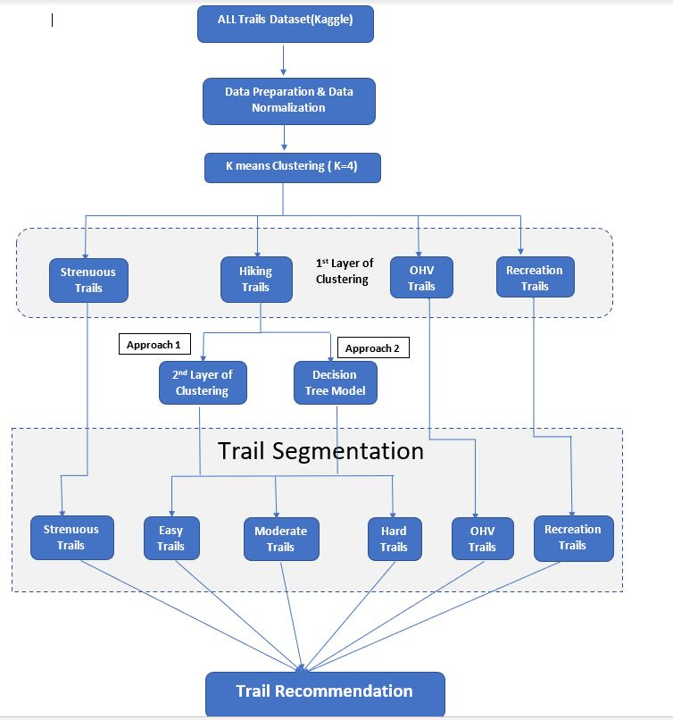

```{r setup, include=FALSE}

knitr::opts_chunk$set(echo = TRUE)

```

```{=tex}
\newpage 
\tableofcontents 
\newpage
```
## I. Introduction:

Trail Segmentation and Trail Recommendation from the user specified trail information.

This dataset (**AllTrails**) is from Kaggle that provides information on the top/best trails in the United States and Hawaii. It comprises of both numerical and categorical variables. The variables in the dataset are:

-   **Trail ID** - A Unique Id given for each trail

-   **Name** - Name of the trail

-   **Area Name** -- Name of the National Park in which the trail is located

-   **City Name** -- City in which the trail is located

-   **State Name** -- State in which the trail is located

-   **Country Name**- Name of the Country

-   **X_geoloc** -- Details about Latitude and Longitude of the trail

-   **Popularity** -- Details about how popular the trail is

-   **Difficulty Rating** (Easy, Moderate, Hard) -- 1,3,5,7

-   **Average Rating** -- It is given by Reviewers (0 to 5)

-   **Number of Reviews** -- Number of reviews for the trail

-   **Length (Meters)** -- Length of the Trail

-   **Elevation Gain (Meters)** -- Elevation Gain of the Trail

-   **Route Type** (Loop, Out & Back, Point to Point)

-   **Visitor Usage** -- Usage of the trail by visitors -- 1,2,3,4

-   **Features** - Trail features such as paved,river,wildlife,views etc..

-   **Activities** - Activities designated mainly for the trails - Camping,birding,biking,walking,hiking etc..

## II. Data Exploration

```{r, comment=NA, message=FALSE, echo=FALSE}
# Loading the required libraries
library(dplyr)
library(cluster)
library(factoextra)
library(cowplot)
library(psych)
library(ggplot2)
library(tidyverse)
library(rpart)
library(rattle)

```

```{r}
#Importing the dataset.
AllTrails_data <- read.csv("AllTrails_new.csv", header = TRUE)
#Check for dimensions
dim(AllTrails_data)
```

This All trails dataset has 3284 observations and 18 features.

\newpage
## III. Data Preparation

This Dataset consists of trails from US and Hawaii. I am going to focus only on the United States Trails.

```{r}

#Filter only US Trails
AllTrails_US_NA<-AllTrails_data %>% filter(country_name == "United States")


```

After filtering only the US Trails, we have 3240 observations and now lets add the test data frame to the dataset

```{r}
df9<-data.frame(trail_id=10259853,name="Cades Cove Loop Road",area_name="Great Smoky Mountains National Park",city_name="Townsend"
,state_name="Tennessee",country_name="United States",X_geoloc="{'lat': 35.60651, 'lng': -83.77419}",popularity=18.8978,length=16254.334,elevation_gain=210.9216,difficulty_rating=1,route_type="loop",visitor_usage=3,avg_rating=4.5,num_reviews=259,features="['ada', 'dogs-no', 'kids', 'paved', 'river', 'views', 'wild-flowers', 'wildlife']",activities="['birding', 'camping', 'road-biking', 'scenic-driving', 'trail-running', 'walking']",units="i")

```

```{r echo=FALSE}
df1<- data.frame(trail_id=10010442,name="Kilauea Iki Trail and Crater Rim Trail",area_name="Hawaii Volcanoes National Park",city_name="Pahala
",state_name="Hawaii",country_name="Hawaii",X_geoloc="{'lat': 19.41648, 'lng': -155.24294}",popularity=25.6723,length=4828.02,elevation_gain=209.7024
,difficulty_rating=3,route_type="loop",visitor_usage=3,avg_rating=4.5,num_reviews=473,features="['dogs-no', 'forest', 'kids', 'views', 'wild-flowers', 'wildlife']",activities="['hiking', 'nature-trips', 'walking']",units="i")

df2 <- data.frame(trail_id=1000000,name="Rock Run OHV Trail",area_name="",city_name="Pennslyvania",state_name="Pennsylvania",country_name="United States",X_geoloc="",popularity=78.98,length=47636.58,elevation_gain=1376.7816,difficulty_rating=3,route_type="Loop",visitor_usage=3,avg_rating=4.5,num_reviews=567,features="['views', 'wild-flowers', 'wildlife']",activities="['OHV/Off-road-driving']",units="i")

df3<- data.frame(trail_id=10000001,name="Tin Cup Hiker",area_name="",city_name="Stanley"
,state_name="Idaho",country_name="United States",X_geoloc="",popularity=25.6723,length=33152.4864,elevation_gain=965.9112
,difficulty_rating=7,route_type="loop",visitor_usage=3,avg_rating=4.5,num_reviews=473,features="['views', 'wild-flowers','forest','lake','river','dogs-leash','wildlife']",activities="['camping','backpacking','hiking']",units="i")

df4<-data.frame(trail_id=10000002,name="Table Rock Trail",area_name="",city_name="Stanley"
,state_name="Idaho",country_name="United States",X_geoloc="",popularity=50.6723,length=5954.57,elevation_gain=267.9192
,difficulty_rating=5,route_type="loop",visitor_usage=4,avg_rating=5,num_reviews=434,features="['views', 'wild-flowers','forest','dogs-leash','wildlife']",activities="['hiking','horseback-riding']",units="i")

df5<-data.frame(trail_id=10012464,name="Delicate Arch Trail",area_name="",city_name="Moab"
,state_name="Utah",country_name="United States",X_geoloc="",popularity=75,length=5149.9,elevation_gain=191.719
,difficulty_rating=5,route_type="out and back",visitor_usage=4,avg_rating=5,num_reviews=2332,features="['dogs-no', 'kids', 'partially-paved', 'views', 'wild-flowers', 'wildlife']",activities="['birding', 'hiking', 'nature-trips', 'rock-climbing', 'walking']",units="i")

df6<-data.frame(trail_id=10026570,name="Ice Lake and Little Gibbon Falls Loop",area_name="Yellowstone National Park",city_name=""
,state_name="Wyoming",country_name="United States",X_geoloc="",popularity=7.1964,length=5954.558,elevation_gain=82.9056
,difficulty_rating=1,route_type="loop",visitor_usage=3,avg_rating=4,num_reviews=30,features="['ada', 'dogs-no', 'forest', 'lake', 'kids', 'strollers', 'waterfall', 'wildlife']",activities="['camping', 'fishing', 'hiking', 'paddle-sports', 'walking', 'canoeing']",units="i")

df7<- data.frame(trail_id=10235836,name="Pine Grove Trail",area_name="Cuyahoga Valley National Park",city_name="Peninsula",state_name="Ohio",country_name="United States",X_geoloc="",popularity=9.7454,length=3218.68,elevation_gain=27.7368,difficulty_rating=1,route_type="loop",visitor_usage=2,avg_rating=4,num_reviews=76,features="['dogs-leash', 'forest', 'kids', 'views']",activities="['birding', 'hiking', 'nature-trips', 'trail-running', 'walking']",units="i")

df8<-data.frame(trail_id=10012464,name="Landscape Arch Trail",area_name="Arches National Park",city_name="Moab"
,state_name="Utah",country_name="United States",X_geoloc="{'lat': 38.78304, 'lng': -109.5952}",popularity=29.3311,length=3057.746,elevation_gain=78.9432
,difficulty_rating=1,route_type="out and back",visitor_usage=3,avg_rating=4.5,num_reviews=398,features="['dogs-no', 'kids', 'partially-paved', 'views', 'wild-flowers']",activities="['birding', 'hiking', 'nature-trips', 'walking']",units="i")


df10<- data.frame(trail_id=10266148,name="Grand Canyon Rim Trail",area_name="Grand Canyon National Park",city_name="Grand Canyon",state_name="Arizona",country_name="United States",X_geoloc="{'lat': 36.05723, 'lng': -112.14378}",popularity=28.2035,length=8690.436,elevation_gain=106.9848,difficulty_rating=1,route_type="out and back",visitor_usage=3,avg_rating=4.5,num_reviews=342,features="['ada', 'dogs-leash', 'kids', 'paved', 'strollers', 'views', 'wild-flowers']",activities="['walking']",units="i")

#df6[,1]<-df[1,]
#df6<-as.data.frame(which(AllTrails_US_NA==df6,arr.ind = TRUE))
#df6


#for(i in 1:length(df$Trail_Name)){
#df[i,c(2,3)]<-as.data.frame(which(AllTrails_US_NA==df$Trail_Name[i],arr.ind = TRUE))
#}


#Add the test dataframe as the first row to the original dataset which can be used while recommending
AllTrails_US_NA<-rbind(df9,AllTrails_US_NA)

```

```{r}
#To check if NA Values exist
colMeans(is.na(AllTrails_US_NA))

```

We can see that 'visitor_usage' column has the missing values in the dataset. So we have removed the NA values.

```{r}
#Omitting the NA Values from the dataset
AllTrails_US<-na.omit(AllTrails_US_NA)

dim(AllTrails_US)
#Remove some of the qualitative variables which is not necessary
Trail_Data <- AllTrails_US[,-c(2,3,4,5,6,7,18)]

```

After removing NA Values, The dataset has 2996 observations and 18 features.

Now, let's create few tags by doing some feature engineering. The remaining features would be categorically tagged with a value of 0 for "No" or 1 for "Yes" depending on if the feature described a given hike. I would be representing them as Trail Tags

\newpage
### Recoding the Trail_Tags:

```{r}

# Catgorically tagging the variables with 1/0 

for(i in 1:length(Trail_Data$activities)){
  
  if(length(grep("driving",Trail_Data$activities[[i]],perl = TRUE, value=FALSE)) > 0 | 
     length(grep("bike",Trail_Data$activities[[i]],perl = TRUE, value=FALSE)) > 0){
    Trail_Data$driving[i] <- "1"
    
  }else{
    Trail_Data$driving[i] <- "0"
  }
}


for(i in 1:length(Trail_Data$activities)){
  
  if(length(grep("canoeing",Trail_Data$activities[[i]],fixed = TRUE, value=FALSE)) > 0 | 
     length(grep("sports",Trail_Data$activities[[i]],perl = TRUE, value=FALSE)) > 0 |
     length(grep("skiing",Trail_Data$activities[[i]],perl = TRUE, value=FALSE)) > 0 | 
     (length(grep("snow",Trail_Data$activities[[i]],perl = TRUE, value=FALSE)) > 0) | 
     length(grep("sports",Trail_Data$activities[[i]],perl = TRUE, value=FALSE)) > 0){
    
    Trail_Data$water_sports[i] <- "1"
    
  }else{
    Trail_Data$water_sports[i] <- "0"
  }
}
 
#View(Trail_Data)

# Convert the variables into numeric 
Trail_Data$trail_id<- as.integer(Trail_Data$trail_id)
Trail_Data$driving <- as.numeric(Trail_Data$driving)
Trail_Data$water_sports <- as.numeric(Trail_Data$water_sports)

# Lets select the features which is required to achieve our objective
Trail_Data_new <- Trail_Data[,-c(1,2,5,6,7,8,9,10,11)]
colnames(Trail_Data_new)

```

### Data Normalization

Since we are dealing with variables of very different nature that are expressed in different units, we have to normalize the data before applying any algorithm.

```{r}
#Normalize the data using scale function
Trail_data_norm<- scale(Trail_Data_new)

#Top rows of the dataset after preprocessing
head(Trail_data_norm)
```

### Distance Measure

For computing distance, we are going to use the **get_distance** function.It uses the Euclidean distance as default metric and **fviz_clust** is to visualize the distance matrix.

```{r}
#Computing distance. Euclidean distance as a default metric
distance<- get_dist(Trail_data_norm)
head(distance)
```

\newpage

# Solution

Flowchart of the approach followed



\newpage
## IV.I Trail Segmentation

To achieve my objective ie, Trail recommendation which is a use case of Trail segmentation. We need to perform Clustering technique as it fits my objective which is to segment the trails.

**The main objective of the Clustering is:** It is the process of grouping a set of objects into the classes of similar objects. Clustering can be used as a stand -- alone tool to gain insight into data distribution and as a preprocessing step of other algorithms in intelligent systems.

Speaking of which, I chose K-means model to be my ML algorithm for this project as it is compatible with high dimensional and large dataset,whereas DB Scan Algorithm doesn't work well with high dimensional data and Hierarchical clustering wasn't able to handle this dataset computationally. So Lets run k-means model.

### To find the Optimal K

The choice of the number of clusters can either be driven by:

-   **External Considerations**(e.g., previous knowledge, practical constraints, etc.)

-   **The Elbow Method**

-   **The Average Silhouette Method**

First, Lets use the two data driven methods to check for the value of K.

```{r}
wss<-fviz_nbclust(Trail_data_norm,kmeans,method = "wss") 
Avg<-fviz_nbclust(Trail_data_norm,kmeans,method = "silhouette")+
labs(subtitle = "Average Silhouette Method")
plot_grid(wss,Avg)

```

From the two methods plotted, we can see that the Elbow Method gives us the optimal value of k is 4, While the Silhouette Method gives us k=3 as a result.

I tried to run k-means Model with both k=3 and 4 and decided to consider withinss to find the optimal k among these two

### Running the K-Means Model (using K=3 & 4)

```{r}
set.seed(123)
# K means model when k=3
k3<- kmeans(Trail_data_norm,centers = 3,nstart = 25)
# K means model when k=4
k4<- kmeans(Trail_data_norm,centers = 4,nstart = 25)

```

\newpage
### Plot for Cluster and WithinSS

These are the plots for clusters with their corresponding Within cluster sum of squared distances when k=3 and k=4

```{r,figures-side, fig.show="hold", out.width="50%", echo=FALSE}
library(RColorBrewer)
coul <- brewer.pal(5, "Set2") 
barplot(k3$withinss,k3$cluster,
        xlab = "Clusters",
        ylab = "Within-Cluster sum of squared distances (WSS)",
        ylim = c(0,4500),
        main = "Plot for Cluster and WSS (k=3)",
        col=coul,legend.text = c("1","2","3"))

barplot(k4$withinss,k4$cluster,
        xlab = "Clusters",
        ylab = "Within-Cluster sum of squared distances (WSS)",
        ylim = c(0,2500),
        main = "Plot for Cluster and WSS (k=4)",
        col=coul,legend.text = c("1","2","3","4"))


```

[**Observations:**]{.ul}

**WithinSS** is a measure of dispersion of the data within the cluster.

-   When we take look at the above plots, It is clearly evident that the clusters in the plot where k=3 looks less homogeneous compared to the clusters in the plot where k=4.

-   The goal here isn't just to make clusters, but to make good, meaningful clusters.Moreover when k=4, it certainly satisfies our objective.

I chose k=4 as the optimal value.

```{r}
# To see the centers of the 4 clusters
k4$centers

# To check the size of clusters
k4$size

#To identify to which cluster sizes belong
table(k4$cluster)
```

```{r echo= FALSE}
set.seed(123)
### Descriptive statistics of 4 clusters

# Adding the corresponding cluster to the original dataset
Trail_cluster <- cbind(Trail_Data_new,k4$cluster)
Trail_whole_data <- cbind(AllTrails_US,k4$cluster)


#Descriptive Statistics of 4 clusters
#describeBy(x=Trail_cluster,group="k4$cluster",skew=FALSE)


```

### Cluster Interpretation (1st layer of Clustering):

```{r echo=FALSE}

# Plotting a graph for the average of all the numerical variables by clusters

Average_of_Variables<- data.frame(k4$centers) %>% rowid_to_column()
colnames(Average_of_Variables) <- c("RowID","Length","Elevation_Gain","OHV","Recreation")

df<-Average_of_Variables %>% 
  pivot_longer(Length:Recreation,names_to = "Variables",values_to = "Average") %>%
  arrange(Variables) 

df$rowid<-as.factor(df$RowID)


#esquisser(df)

library(ggplot2)

ggplot(df) +
 aes(x = Variables, fill = rowid, group = rowid, weight = Average) +
 geom_bar(width=0.5,position = "dodge") +
 scale_fill_hue(direction = 1) +
 labs(fill = "Cluster") +
 theme_minimal() 
```

We can see that 4 clusters with sizes of different characterizations:

-   **Cluster1:** Strenuous Trails

-   **Cluster2:** Recreation Trails

-   **Cluster3:** OHV Trails

-   **Cluster4:** Hiking Trails

```{r echo=FALSE}
Trail_Clust<-Trail_whole_data[order(Trail_whole_data$`k4$cluster`),]
Trail_clust1<-Trail_whole_data[Trail_whole_data$`k4$cluster` == 1,]
Trail_clust2<-Trail_whole_data[Trail_whole_data$`k4$cluster` == 2,]
Trail_clust4<-Trail_whole_data[Trail_whole_data$`k4$cluster` == 4,]
Trail_clust3<-Trail_whole_data[Trail_whole_data$`k4$cluster` == 3,]
#write.csv(Trail_Clust,"clust.csv")

```

We are mainly focused on hiking trails and to cluster those trails into Easy, Moderate, and Hard trails

After the first layer of clustering, we are down to 4 clusters. Now,lets consider Cluster1 which has only the hiking trails.

\newpage

### Approach 1: Using K-Means Model (Second Layer of Clustering)

Further clustering only the Hiking trails which are in Cluster 1

```{r}
# Considering only Elevation Gain 
Trail_clust_Data_new <- Trail_clust4[,c(10)]


# Data Normalization

#Scale the dataset
Trail_clust_data_norm<- scale(Trail_clust_Data_new)
#Distance Measure
distance1<- get_dist(Trail_clust_data_norm)

```

### Running K-Means Model

As my main objective of this doing this second layer of clustering is to divide the data into 3 segments namely, Easy, moderate, and Hard Trails.

So,I chose k =3 and lets run the model with k=3

```{r}
set.seed(123)

k3_clust<- kmeans(Trail_clust_data_norm,centers = 3,nstart = 25)
#size of the cluster
k3_clust$size

table(k3_clust$cluster)
```

```{r echo=FALSE}

set.seed(123)

# Adding the corresponding cluster to the original dataset

Trail_cluster_new <- cbind(Trail_clust_Data_new,k3_clust$cluster)

colnames(Trail_cluster_new) <- c("Gain","cluster")

Trail_cluster_new <- as.data.frame(Trail_cluster_new)

for(i in 1:length(Trail_cluster_new$cluster))

if(Trail_cluster_new$cluster[i] == 1) {
  
  Trail_cluster_new$cluster[i] = 1
  
}else if(Trail_cluster_new$cluster[i] == 2){
  
   Trail_cluster_new$cluster[i] = 5
   
}else{
  Trail_cluster_new$cluster[i] = 6
}

# Adding the corresponding cluster to the original dataset
Trail_whole_data_clust <- cbind(Trail_clust4[,-19],k3_clust$cluster)


for(i in 1:length(Trail_whole_data_clust$`k3_clust$cluster`))

if(Trail_whole_data_clust$`k3_clust$cluster`[i] == 1) {
  
  Trail_whole_data_clust$`k3_clust$cluster`[i] = 1
  
}else if(Trail_whole_data_clust$`k3_clust$cluster`[i] == 2){
  
   Trail_whole_data_clust$`k3_clust$cluster`[i] = 5
   
}else{
  Trail_whole_data_clust$`k3_clust$cluster`[i] = 6
}
#View(Trail_whole_data_clust)

```

```{r }
### Descriptive Statistics of 3 clusters
#Descriptive Statistics of 3 clusters
#describeBy(x=Trail_cluster_new,group="cluster",skew=FALSE)


```

### Cluster Interpretation ( 2nd layer of clustering)

```{r echo=FALSE}
Avg_of_Variables<- data.frame(k3_clust$centers) %>% rowid_to_column()
colnames(Avg_of_Variables) <- c("RowID","Elevation_Gain")

df<-Avg_of_Variables %>% 
  pivot_longer(Elevation_Gain,names_to = "Variables",values_to = "Average") %>%
  arrange(Variables) 

df$rowid<-as.factor(df$RowID)


#esquisser(df)


ggplot(df) +
 aes(x = Variables, fill = rowid, group = rowid, weight = Average) +
 geom_bar(width=0.5,position = "dodge") +
 scale_fill_hue(direction = 1) +
 labs(fill = "Cluster") +
 theme_minimal() 
```

We can see that 3 clusters of Hiking Trails with different characterizations:

-   **Cluster1:** Moderate Trails

-   **Cluster2:** Hard Trails

-   **Cluster3:** Easy Trails

### Combining two layers of clustering

Size of each cluster 
```{r echo=FALSE}

Trail_Clust_k<-Trail_whole_data_clust[order(Trail_whole_data_clust$`k3_clust$cluster`),]
colnames(Trail_Clust_k) <-c("trail_id","name","area_name", "city_name", "state_name","country_name",
                            "X_geoloc","popularity","length" ,           "elevation_gain", "difficulty_rating", "route_type","visitor_usage","avg_rating" ,"num_reviews", "features" ,"activities","units","k4$cluster"  )

final_cluster<-Trail_Clust %>% filter(Trail_Clust$`k4$cluster`!=1)
whole_cluster<-rbind(final_cluster,Trail_Clust_k)
whole_cluster<-whole_cluster[order(whole_cluster$`k4$cluster`),]


colnames(whole_cluster)<-c("trail_id","name","area_name", "city_name", "state_name","country_name",
                           "X_geoloc","popularity","length" ,           "elevation_gain", "difficulty_rating", "route_type","visitor_usage","avg_rating" ,"num_reviews", "features" ,"activities","units","cluster_final")


#Size of each cluster
table(whole_cluster$cluster_final)
```

### Cluster Interpretation of 6 Clusters:

```{r echo=FALSE}

cluster_summary <- aggregate(whole_cluster[,c(9:10)],list(whole_cluster$cluster_final),mean)
cluster_summary

#Plots of cluster summary

#barplot(cluster_summary$length,col = "blue", main = "Length of All trails" )
#barplot(cluster_summary$elevation_gain,col = "red", main = "Elevation of All trails" )


# Plotting a graph for the average of all the numerical variables by clusters

Avg_vars<- data.frame(cluster_summary[,c(2,3)]) %>% rowid_to_column()


df<-Avg_vars %>% 
  pivot_longer(length:elevation_gain,names_to = "Variables",values_to = "Average") %>%
  arrange(Variables) 

df$rowid<-as.factor(df$rowid)


ggplot(df) +
 aes(x = Variables, fill = rowid, group = rowid, weight = Average) +
 geom_bar(width=0.5,position = "dodge") +
 scale_fill_hue(direction = 1) +
 labs(fill = "Cluster") +
 theme_minimal() 


```

We can see that 6 clusters with sizes of different characterizations:

-   **Cluster1:** Strenuous Trails

-   **Cluster2:** Recreation Trails

-   **Cluster3:** OHV Trails

-   **Cluster4:** Moderate Trails

-   **Cluster5:** Hard Trails

-   **Cluster6:** Easy Trails

\newpage

### Approach 2: Using Decision Tree Model

To find the threshold values of length or Elevation gain in that hiking trails cluster, we are using Decision tree model.

```{r}
#install.packages("rattle")


Model1<-rpart(difficulty_rating ~ length+elevation_gain,data=Trail_clust4,method='class')

fancyRpartPlot(Model1)


```

It divided into 3 leaf nodes considering elevation gain as a parameter and this values can be used during trail recommendation

## IV.II Trail Recommendation:

It is one of the use case of Trail segmentation and lets recommend the similar trails using the threshold values from the decision tree.

Here, a distance matrix is created using the cluster centroids and the user inputs. Once the cluster that is most similar is chosen, another distance matrix is used to determine which hikes in the cluster are closest. The recommended hike is a random choice of the top three most similar hikes.

```{r}

    
    #Extracted Elevation_gain from the user input 
    test_gain<-AllTrails_US_NA[1,10]

    pt<-Trail_data_norm[,1:4]
    #user input
    pt[1,]

    # Calculate a distance matrix using cluster centroids and the user input

    closest = as.matrix(get_dist(rbind(pt[1,],k4$centers)))[-1,1]


    # Choosing the most similar cluster 

    clust_num = which(closest %in% min(closest))
   

    # Calculate  a distance matrix to determine which hikes in the cluster are closest.

    similar = pt[k4$cluster == clust_num, ]
    likely = as.matrix(get_dist(rbind(pt[1,], similar)))[-1,1]
    names(likely) = row.names(similar)

    # Extracting only top 5 to 6 columns
    top<-head(sort(likely))
    output<-AllTrails_US_NA[as.numeric(names(top)), ]


    final_result<- output[,c(2,5,9,10)]
    colnames(final_result)<- c("Trail_Name","State","Length(mts)","Elevation(mts)")

    if(clust_num==4){
      if(test_gain <= 147.00){
      cat("These are Easy Trails.\nJust relax with a small stroll and enjoy bird watching.\nHere are some similar Trails where you can enjoy with kids")
        final_result
    }else if( test_gain >= 147.00 & test_gain<=563.00){
       cat("You have selected the Moderate Trails.\nThese are mainly for hiking,bird watching and to enjoy wildlife.Below are some similar Trails")
      final_result
    }else
cat("Hard and Challenging Trails.Here are some of the Hard trails.\nDont forget to backpack and carry lots of fluids.\nThese trails are mainly for Hiking and enjoying wildlife")
      final_result
    }else if(clust_num==2){
        cat("These are Recreation Trails.\nThese are primarily used for fun activities such as paddle sports,caneoing,skiing and kayaking.\nHere are some similar trails.")
      final_result
      
    }else if(clust_num==3){
          cat("These are OHV trails.\nThese are mainly for Off-Road Driving,Road-Biking,Scenic Driving and Bike Touring.\nHere are some of the similar trails you would like to try.")
      final_result
      
    }else 
cat("These are Strenous Trails and Here are some Similar trails.\nThese are designed for hiking,backpacking and camping.")
      final_result
      
```

# V. Conclusion:

In a nutshell, I would like to conclude that Wanderlust Bundle will give two scenarios

-   **Trail Segmentation:** in which the entire dataset has been segmented into 6 clusters which can be used by the business based on the use cases.

-   **Trail Recommendation:** is one such use case of the segmentation where similar trails are recommended along with their designated activities based on the user specified trails.

# VI. Final Thoughts:

So many of our daily decisions are made on the basis of recommendations. The list may go on and on, whether it's food, restaurants, movies, or retail merchandise. It's also crucial to know that what is being recommended to us will be something that we will have a high confidence that we know we will like or enjoy. Wanderlust Bundle was created to help people identify user-friendly paths and to save lot of time. If I had more time and data to develop Wanderlust Bundle, I could have put some additional data into the project that could have been useful. Trail user information may have been integrated during the data collection procedure. Additional types of recommender models, such as an Item Similarity Recommender, may have been explored if user ratings had been available. Additionally, weather data points for each trail may have been collected and added as model elements and more interested in creating interactive website for the user input.
