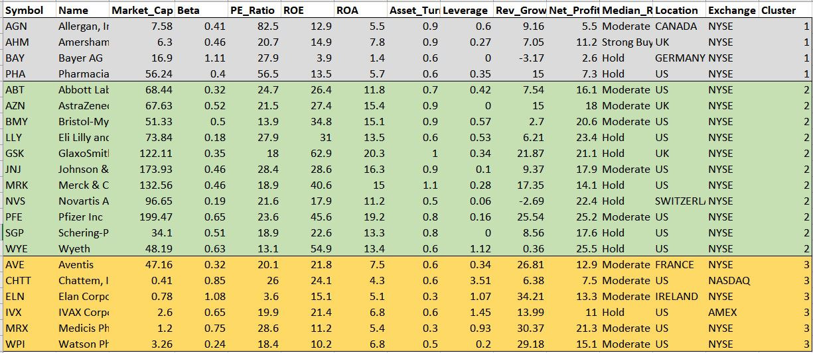
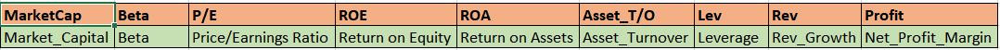

# K-Means Algorithm (CLUSTERING)

The objective of this assignment is to use **K-Means for Clustering** the Pharmaceutical data

An equities analyst is studying the pharmaceutical industry and would like your help in exploring and understanding the financial data collected by 
her firm. Her main objective is to understand the structure of the pharmaceutical industry using some basic financial measures. Financial data 
gathered on 21 firms in the pharmaceutical industry are available in the file Pharmaceuticals.csv.

For each firm, the following variables are recorded:  

1. **Market capitalization** (in billions of dollars) - Total market value of company's outstanding shares of stock.

2. **Beta**  - Volatility of the security in regards to Market movement. 

3. **Price/earnings ratio** - Higher Ratio could conclude either security is overvalued or expect to have future profits.

4. **Return on equity** - Ratio of Revenues, excluding all dividends, to the number of equities. Higher the ROE, better the company is performing.

5. **Return on assets** - an indicator of how profitable a company is relative to its total assets (Net Income / Total Assets).

6. **Asset turnover** - It means how efficiently the company is using it's assets to produce the asset, Higher the better.

7. **Leverage** - Ratio of Debt to Equity. Lesser the better.

8. **Estimated revenue growth** - Revenue growth is the increase (or decrease) in a company's sales from one period to the next. 

9. **Net profit margin** - Ratio of net profit to the revenue. Higher the better.

10. **Median recommendation** (across major brokerages) -The mean or median recommendation that analysts make on a stock. The consensus       recommendation is calculated simply by compiling recommendations and taking the average or median.

11. **Location of firm’s headquarters** - Location of the firm.

12. **Stock exchange** on which the firm is listed 


```{r setup, include=FALSE}
knitr::opts_chunk$set(echo = TRUE)

chooseCRANmirror(graphics = getOption("menu.graphics"), ind = 79,
                 local.only = FALSE)
```
\newpage
## LOADING REQUIRED PACKAGES
```{r message=FALSE}

# Loading the required packages and install packages if necessary
#install.packages("psych")
library(psych)
#install.packages("dplyr")
library(dplyr)
#install.packages("cowplot")
library(cowplot)
#install.packages("esquisse")
library(esquisse)
#install.packages("ggplot2")
library(ggplot2)
#install.packages("factoextra")
library(factoextra)
#install.packages("cluster")
library(cluster)
#install.packages("tidyverse")
library(tidyverse)
#install.packages("tibble")
library(tibble)
#install.packages("knitr")
library(knitr)
```
\newpage
## Questions

### A. Use only the numerical variables (1 to 9) to cluster the 21 firms. Justify the various choices made in conducting the cluster analysis, such as weights for different variables, the specific clustering algorithm(s) used, the number of clusters formed, and so on. 

## Data Preparation
```{r results='asis'}
Pharmaceutical_data<- read.csv("Pharmaceuticals.csv")
# Extracted Numerical Variables only 
df_Numerical <-Pharmaceutical_data[,c(3:11)]
row.names(df_Numerical) <- Pharmaceutical_data[,1]
# Pharamaceutical Data
kable(df_Numerical, caption= "Pharmaceutical Data")
# Checking for NA Values
NA_Check<-colMeans(is.na(df_Numerical))
print(paste("There are no 'NA(Missing)' Values in the Dataset"))

```
\newpage

## Data Normalization
```{r}
# Data Normalization
df_Norm_Numerical <- scale(df_Numerical)
```

## Distance Measure

For computing distance, we are going to use the **get_distance** function.It uses the Euclidean distance as default metric and **fviz_clust** is to visualize the distance matrix.

```{r}
#Computing distance. Euclidean distance as a default metric
distance<- get_dist(df_Norm_Numerical)
head(distance)
# Plotting the distance. 
fviz_dist(distance)
```

### Distance Matrix Plot

This plot shows the different intensity of color for different distances.As we can see , the diagonal has a value equal to zero because it indicates the distance of an observation from itself.The purple indicates that farthest distance between the point and red indicates the nearest distance.

## Running the K-means Model

**The main objective of the Clustering is:**
We group similar items into a cluster, with each cluster behind different from other clusters. That is, the variation among the items in a cluster should be small compared to the variation between the clusters. 

* First we will select a random value for k and run the model. Here, I selected **k=2** as random number and run the k Model
```{r}
set.seed(123)

# Running the K means model with Random number K=2
k2<- kmeans(df_Norm_Numerical,centers = 2,nstart = 25)

# To see the Results
#print(k2)

# To see the centers of the 2 clusters
k2$centers

# To check the size of clusters
k2$size

# Identify the cluster of the 20th observation as Example
k2$cluster[20]
```

\newpage

### Visualize When K=2
```{r}
#Lets visualise the 2 clusters
fviz_cluster(k2,data = df_Norm_Numerical)
```
This plot gives us a detailed representation of the 2 clusters with the firms based on their Numerical variables. However, we chose the k value as random number without a substantial reason. So now we have to perform the data driven methods to chose our best k.


\newpage

## Choosing the best K

When there are no external considerations,the choice of K is done by using data driven methods.
such as:

* **The Elbow Method**

* **the Average Silhouette Method**
        

### Elbow Method 
```{r}
# Elbow Method
fviz_nbclust(df_Norm_Numerical,kmeans,method = "wss") +
  geom_vline(xintercept = 2,linetype=2)+
  labs(subtitle = "Elbow Method")
```

\newpage

### Average Silhouette Method
```{r}
# Average Silhouette Method
fviz_nbclust(df_Norm_Numerical,kmeans,method = "silhouette")+
labs(subtitle = "Average Silhouette Method")
```

From the two methods plotted, we can see that the Elbow Method gives us the optimal value of k is 2, While the Silhouette Method gives us k=5 as a result.

We have already ran the model with K=2 (which was the random number).Now we will run the k-means algorithm with 5 clusters and lets visualize it.

\newpage

## K-means Model using K=5
```{r}
set.seed(123)

# Kmeans model using k=5
k5 <- kmeans(df_Norm_Numerical,centers = 5,nstart = 25)

# To see the centers of the 5 clusters
k5$centers

# To check the size of the 5 clusters
k5$size

#To identify to which cluster sizes belong
table(k5$cluster)
```

\newpage

### Visualize when K=5

```{r}
# Lets visualize the 5 clusters
fviz_cluster(k5,data = df_Norm_Numerical)
```


when we visualize the plot, We can see that 5 clusters with size of different characterizations:

* Cluster1 -(8 Firms) - Firms with Low Revenue Growth
* Cluster2 -(3 Firms) - High Leverage
* Cluster3 -(2 Firms) - High P/E Ratio
* Cluster4 -(4 Firms) - High Market Capitalization
* Cluster5 -(4 Firms) - Low Asset Turnover

\newpage

### Plot for Cluster and WithinSS

```{r}
library(RColorBrewer)
coul <- brewer.pal(5, "Set2") 
barplot(k5$withinss,k5$cluster,
        xlab = "Clusters",
        ylab = "Within-Cluster sum of squared distances (WSS)",
        ylim = c(0,25),
        col=coul,legend.text = c("1","2","3","4","5"))

```

This is the plot for clusters with their corresponding Within cluster sum of squared distances.
 
**WithinSS** is a measure of dispersion of the data within the cluster.When we take look at the above plot,It is clearly evident that Cluster1 is less homogeneous compared to the Cluster3. Moreover the records in the data set are very few to divide into 5 clusters and not able to find any significant trends with 5 clusters.The goal here isn’t just to make clusters, but to make good, meaningful clusters.

For better Interpretation of cluster analysis, I decided to run the model with k=3. Since, with only 2 clusters, we might lose the main characteristics of the data. So lets run the model with k=3

\newpage
## Running the K-means Model with K=3 (For Better Interpretation)
```{r}
#Run the K model with k=3
set.seed(123)
k3<- kmeans(df_Norm_Numerical,centers = 3,nstart = 25)

# To see the centers of the 5 clusters
k3$centers

# To check the size of clusters
k3$size

#To identify to which cluster seizes belong
table(k3$cluster)
```
### Visualize when (K=3)
```{r}
fviz_cluster(k3,data = df_Norm_Numerical)

```

When we visualize the plot, We can see that 3 clusters with sizes of different characterizations:

* **Cluster1:** 4 Firms (AHM,PHA,BAY,AGN)

* **Cluster2:** 11 Firms (PFE,GSK,MRK,JNJ,BMY,SGP,ABT,WYE,AZN,LLY,NVS)

* **Cluster3:** 6 firms (AVE,WPI,IVX,CHTT,MRX,ELN)

**Weightage for different variables:** 

* To consider weightage for the variables, we have to check for the Standard Deviation or Variance. If the sd/variance of any variables is high, which implies that those variables has higher weightage. 

* In our case, P/E Ratio, Market_Capital, ROE, ROA, Net_Profit_Margin and Asset_Turnover has high variance , so we can consider these variables to have higher weightage among all the variables.

Also, we can assign weightage to each variables using PCA (Principal Component Analysis)

## B. Interpret the clusters with respect to the numerical variables used in forming the clusters. 

```{r}

#Adding a cluster column for all the firms

Pharma_data_Cluster<- cbind(Pharmaceutical_data,cluster=as.factor(k3$cluster))
Pharma_Clust<-Pharma_data_Cluster[order(Pharma_data_Cluster$cluster),]

```

With respect to Numeric Variables, we have combined the data with their corresponding clusters.



```{r}

# Plotting a graph for the average of all the numerical variables by clusters

Average_of_Variables<- data.frame(k3$centers) %>% rowid_to_column()
colnames(Average_of_Variables) <- c("RowID","MarketCap","Beta","P/E","ROE","ROA",
                                    "Asset_T/O",
                                    "Lev","Rev","Profit")
colnames(Average_of_Variables)
df<-Average_of_Variables %>% 
  pivot_longer(MarketCap:Profit,names_to = "Variables",values_to = "Average") %>%
  arrange(Variables) 

df$rowid<-as.factor(df$RowID)


#esquisser(df)

library(ggplot2)

ggplot(df) +
 aes(x = Variables, fill = rowid, group = rowid, weight = Average) +
 geom_bar(width=0.5,position = "dodge") +
 scale_fill_hue(direction = 1) +
 labs(fill = "Cluster") +
 theme_minimal() 
```


The above plot helps us to differentiate by cluster wise with their averages of the numerical variables.

## C. Is there a pattern in the clusters with respect to the non-numerical variables (10 to 12)? (those not used in forming the clusters) 

Let us now consider the 3 categorical variables: Median Recommendation, Location and Stock Exchange.

**Median Recommendation:** (across major brokerages) -The mean or median recommendation that analysts make on a stock. The consensus       recommendation is calculated simply by compiling recommendations and taking the average or median.

**Location:**  Location of the firm.

**Exchange:** The firm in which securities are bought and sold.

In order to look for possible trends within data, I decided to leverage bar charts to graphically visualize the distribution of the firms grouped by clusters.


```{r}

Median_Rec <- ggplot(Pharma_Clust) +
 aes(x = cluster, fill = Median_Recommendation) +
  geom_bar(position = "dodge") +
 scale_fill_hue(direction = 1) +
 labs(x = "Clusters", y = "Frequency", title = "Cluster Vs. Median Recommendation") 

Exchange <-ggplot(Pharma_Clust) +
 aes(x = cluster, fill = Exchange) +
 geom_bar(position = "dodge") +
 scale_fill_hue(direction = 1) +
labs(x = "Clusters", y = "Frequency", title = "Cluster Vs. Exchange") +
 theme_minimal()

Location <-ggplot(Pharma_Clust) +
 aes(x = cluster, fill = Location) +
 geom_bar(position = "dodge") +
 scale_fill_hue(direction = 1) +
  labs(x = "Clusters", y = "Frequency", title = "Cluster Vs. Location") +
 theme_minimal()

plot_grid(Median_Rec,Exchange,Location)

```

I do not find any possible trends with Location and Exchange variables as they spread in all the clusters which doesn't play a major role in identifying the patterns between the clusters. 
Whereas Median Recommendation shows a slight pattern on the clusters.

* Cluster 1: Hold, Moderate Buy and Strong buy which indicates that firms may outperform in the future.

* Cluster 2 & Cluster 3 : Has a mix of Hold,Moderate Buy and moderate sell which indicates that average risk and profit.
 

## D. Provide an appropriate name for each cluster using any or all of the variables in the dataset. 

CLUSTER 1 : **Overvalued International Firms**

*  High PE Ratio either indicates that the stock is overvalued or analysts predict that the company will perform well in the future(Long term).

*  Good Assert Turnover represents that that company is handling their assets efficiently to generate rev while ROE looks moderate.

*  High beta indicates that companies are volatile to the Market movement.

*  Lowest leverage among the clusters.

CLUSTER 2 : **High Capital Profitable Firms** (Mature Firms) - The companies with high number of stocks and / or high share prices.

* High Cap indicates that company has high total market price (Share price * total outstanding stocks).

* High ROE & ROA - Indicates that Companies are performing well and producing profits

* High Asset turnover depicts that company is efficiently handling all of their assets to generate the revenue

* Companies has a high Net Profit Margin which is the ration of Profit to the revenue. For every 100$, Company produces a profit of 20.17

* Low leverage indicates that company owns more asset than the debt which is less risk.

CLUSTER 3 : **High Leveraged  and UnderValued Firms** - Company runs on the borrowed capital which could be risky. High Leverage indicates higher Debt than the Equity / asset the company owns.

* Undervalued (Low P/E) 

* Low beta indicates that company is less volatile to Market movements

* High leverage means that company is running on high borrowed capital, high risk

* Higher revenue growth


In a nutshell, 

**Cluster 1** can be labeled as **OVERVALUED INTERNATIONAL FIRMS** due to high Price/Earnings ratio and low Net Profit Margin .
Buying overvalued firms can be risky, as they might drop closer to their intrinsic value at any time, especially over the short term. Over the long term, the intrinsic value of healthy and growing companies will grow. But it's still possible to simply pay too much for a stock. so these companies need to meet investor's expectations by investing and increasing the profits and maintaining their stock price if they do not want their stock price to decrease and these firms should be able to perform Business Continuity Plan as these firms are volatile to the market movements due to high Beta.

**Cluster 2** can be represented as **HIGH CAPITAL PROFITABLE FIRMS (MATURE FIRMS)** due to High Profit and market capitalization.These firms also has high ROE,ROA and Asset turnover which indicates that these firms are performing well and handling all their assets to generate a good revenue.
Buying these firms is of less risk as these are well stable, runs on less debt and matured enough to handle the fluctuations in market.

**Cluster 3** can be characterized as **HIGH LEVERAGED AND UNDERVALUED FIRMS** due to Low Price/Earnings ratio and high leverage.
An undervalued stock is one with a market price that is significantly lower than its real or 'fair' value (market value < fair value).But Undervalued stocks are expected to go higher and these firms are estimated to generate higher revenue growth. This seems to be a good option for few investors. However, these firms should concentrate on gaining investor confidence, financial health of the company and asset turnover.

